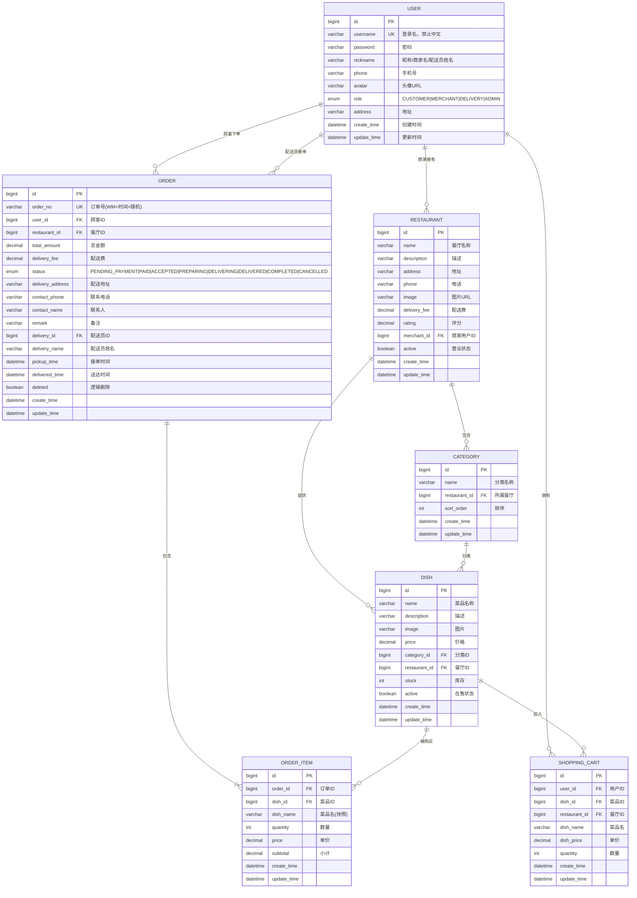

# 外卖配送系统 E-R 图



## 实体关系说明

| 实体 | 说明 | 关键字段 |
|------|------|---------|
| `USER` | 用户（含顾客/商家/配送员/管理员四种角色） | `role` 区分身份 |
| `RESTAURANT` | 餐厅，通过 `merchant_id` 关联商家用户 | `active` 控制营业状态 |
| `CATEGORY` | 菜品分类，归属某个餐厅 | `sort_order` 控制显示顺序 |
| `DISH` | 菜品，归属分类和餐厅 | `price` 可被商家修改，`active` 控制上下架 |
| `ORDER` | 订单，关联顾客和餐厅 | `delivery_id` 关联配送员，`status` 状态机流转 |
| `ORDER_ITEM` | 订单明细，记录购买时的菜品快照 | 即使菜品被删除，订单中仍保留名称和价格 |
| `SHOPPING_CART` | 购物车，每个用户在不同餐厅有独立购物车 | 切换餐厅时提示清空 |

## 状态流转

```
订单状态机:

PENDING_PAYMENT ──支付──→ PAID ──接单──→ DELIVERING ──送达──→ DELIVERED ──→ COMPLETED
       │                     │
       └──取消──→ CANCELLED   └──取消──→ CANCELLED
```

## 主外键关系

```
USER.id ───→ RESTAURANT.merchant_id    (商家→餐厅)
USER.id ───→ ORDER.user_id             (顾客→订单)
USER.id ───→ ORDER.delivery_id         (配送员→订单)
USER.id ───→ SHOPPING_CART.user_id     (用户→购物车)
RESTAURANT.id ───→ CATEGORY.restaurant_id  (餐厅→分类)
RESTAURANT.id ───→ DISH.restaurant_id      (餐厅→菜品)
CATEGORY.id ───→ DISH.category_id           (分类→菜品)
ORDER.id ───→ ORDER_ITEM.order_id           (订单→明细)
DISH.id ───→ ORDER_ITEM.dish_id             (菜品→订单明细)
DISH.id ───→ SHOPPING_CART.dish_id          (菜品→购物车)
```
